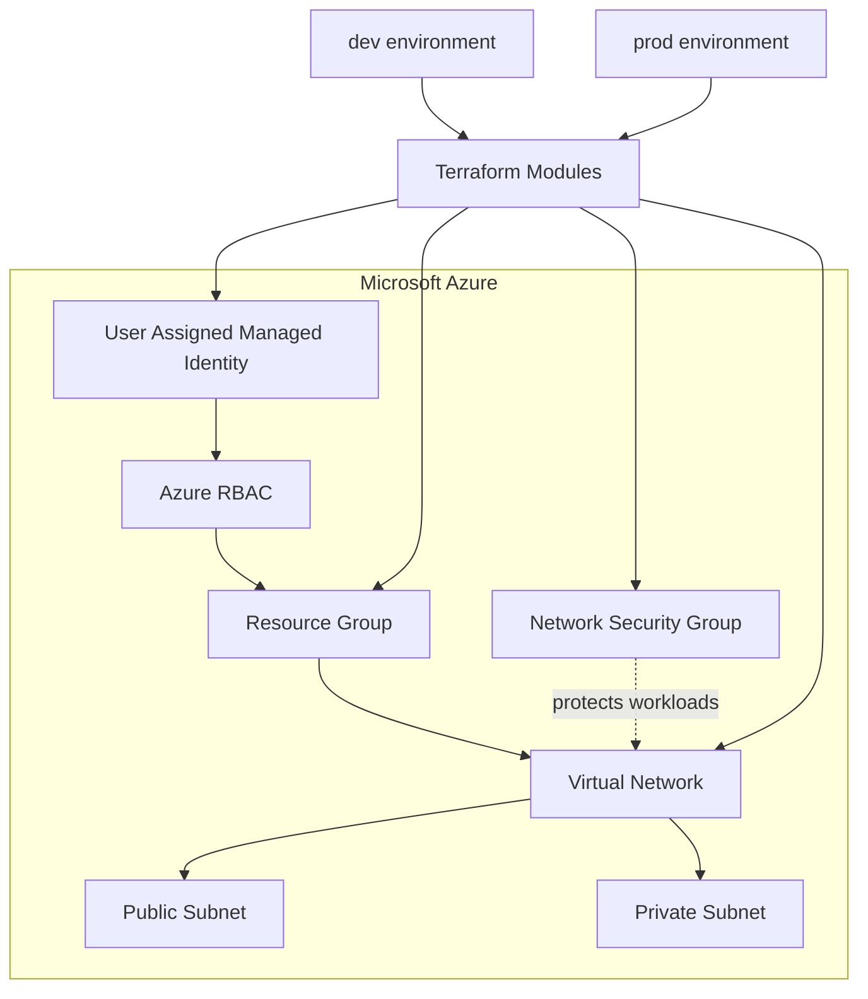

<div align="center">

# Terraform Cloud Infrastructure

### Azure Infrastructure as Code · Security · Identity · Environment Automation

[](https://www.terraform.io/)
[](https://azure.microsoft.com/)
[](https://github.com/features/actions)
[](#security-design)

**A production-style Azure foundation demonstrating reusable Terraform modules, environment separation, network boundaries, managed identity and CI validation.**

</div>

---

## 🎯 What this project demonstrates

This repository is the **Infrastructure as Code layer** of my Cloud / DevOps portfolio. It focuses on how infrastructure should be structured before application workloads are introduced.

The design separates reusable infrastructure from environment-specific composition and applies security controls at the network and identity layers.

### Core capabilities

- ☁️ Azure Resource Groups and Virtual Networks
- 🌐 Public and private subnet boundaries
- 🔐 Network Security Groups with explicit inbound rules
- 🪪 User-assigned Managed Identity
- 🛡️ Azure RBAC with resource-group scoped access
- 🧩 Reusable Terraform modules
- 🔀 Independent `dev` and `prod` compositions
- 🏷️ Consistent resource naming and tagging
- ✅ Automated Terraform formatting and validation with GitHub Actions
- 🚫 No cloud credentials or Terraform state committed to Git

---

## 🏗️ Architecture



> **Design note:** this portfolio baseline creates the network and security foundation. It does not pretend to be a complete production landing zone. Workloads, private endpoints, NAT, centralized logging and advanced policy controls can be layered on top as the platform evolves.

---

## 🧩 Module architecture

The root environments compose reusable modules instead of duplicating resource definitions.

```text
modules/
├── networking/   → VNet + public/private subnets
├── security/     → Network Security Group
└── iam/          → Managed Identity + Azure RBAC

                    ↓

          environments/dev
          environments/prod
```

### Why this structure?

**Reusable modules** contain infrastructure implementation.

**Environment directories** own environment-specific values such as region, CIDR ranges, names and tags.

This keeps changes localized and makes it possible to evolve `dev` and `prod` independently without copying Terraform logic.

---

## 🌐 Network design

Each environment creates an Azure Virtual Network with separate public and private subnet address spaces.

The current baseline intentionally keeps the private subnet without an implicit Internet egress design. If workloads require outbound Internet access, a controlled NAT / firewall architecture should be introduced rather than exposing the private tier directly.

The security module adds an NSG with an explicit model:

- HTTP/80 allowed from the Azure Virtual Network
- Internet-originated inbound traffic explicitly denied
- Security rules kept separate from the networking module for easier review

---

## 🔐 Security design

Security is part of the infrastructure design rather than an afterthought.

### Identity

The IAM module creates a **user-assigned managed identity** and assigns the Azure **Reader** role at the environment resource-group scope. This avoids embedding service-principal secrets in Terraform configuration.

### Network security

The security module defines the Network Security Group independently from networking, making security rules easier to inspect and modify.

### Source control

The repository excludes Terraform state, variable files containing local values, private keys and other sensitive artifacts through `.gitignore`.

See [`SECURITY.md`](SECURITY.md) for the security model and responsible disclosure guidance.

---

## 🔄 CI workflow

GitHub Actions validates both environments on pushes to `main` and pull requests.

```text
Git Push / Pull Request
          ↓
    Checkout source
          ↓
   Setup Terraform
          ↓
    Format check
          ↓
  Terraform init
   (no backend)
          ↓
 Terraform validate
      dev + prod
```

The workflow intentionally **does not run `terraform apply`**. Infrastructure changes should be reviewed through a plan and an explicit deployment process rather than being applied automatically from this validation pipeline.

---

## 📁 Repository structure

```text
terraform-cloud-infrastructure/
│
├── .github/
│   └── workflows/
│       └── terraform.yml
│
├── architecture/
│   └── architecture.md
│
├── environments/
│   ├── dev/
│   │   ├── main.tf
│   │   ├── variables.tf
│   │   ├── outputs.tf
│   │   └── terraform.tfvars.example
│   │
│   └── prod/
│       ├── main.tf
│       ├── variables.tf
│       ├── outputs.tf
│       └── terraform.tfvars.example
│
├── modules/
│   ├── networking/
│   ├── security/
│   └── iam/
│
├── .gitignore
├── Makefile
├── SECURITY.md
└── README.md
```

---

## 🚀 Local validation

### Prerequisites

- Terraform `>= 1.6`
- Azure CLI
- An Azure subscription

Authenticate:

```bash
az login
az account set --subscription "<subscription-id>"
```

### Validate dev

```bash
cd environments/dev
terraform init
terraform fmt -recursive
terraform validate
terraform plan
```

### Validate prod

```bash
cd environments/prod
terraform init
terraform fmt -recursive
terraform validate
terraform plan
```

For an actual deployment, review the plan carefully and use the appropriate environment-specific credentials and state-management strategy.

---

## 🧠 Engineering decisions

| Decision | Reason |
|---|---|
| Separate `dev` and `prod` | Prevent environment-specific configuration from leaking into reusable modules |
| Reusable Terraform modules | Reduce duplication and create consistent infrastructure interfaces |
| Managed Identity | Avoid long-lived application credentials in source code |
| Resource-group scoped RBAC | Keep identity permissions constrained to the environment boundary |
| Separate security module | Make network security rules independently reviewable |
| CI validation without apply | Keep validation safe and separate from production change execution |
| Private subnet without implicit Internet egress | Establish a safer baseline before adding controlled outbound access |

---

## 🧪 Validation checklist

Before merging infrastructure changes:

- [ ] `terraform fmt -check -recursive`
- [ ] `terraform init -backend=false`
- [ ] `terraform validate` for `dev`
- [ ] `terraform validate` for `prod`
- [ ] Review Terraform plan before deployment
- [ ] Confirm no secrets or state files are committed
- [ ] Review IAM scope and network security changes

---

## 🔮 Roadmap

The next iterations of this project can extend the foundation with:

- [ ] Remote encrypted Terraform state
- [ ] Policy-as-code with Checkov or OPA
- [ ] Terraform plan artifacts on pull requests
- [ ] Controlled production approval gates
- [ ] Azure Key Vault integration
- [ ] Private endpoints and controlled egress
- [ ] Centralized logging and diagnostics
- [ ] AKS workload integration
- [ ] GitOps deployment with Argo CD

The goal is to evolve the repository toward a realistic **secure cloud platform foundation**, not simply add more Terraform resources.

---

## 🛠️ Technology Stack

**Terraform · Microsoft Azure · Azure VNet · Azure NSG · Azure RBAC · Managed Identity · GitHub Actions · Infrastructure as Code · Cloud Security**

---

## 👨‍💻 Author

**Vasid Shaik**  
Cloud / DevOps / SRE Engineer

[GitHub](https://github.com/ShaikVasid)
