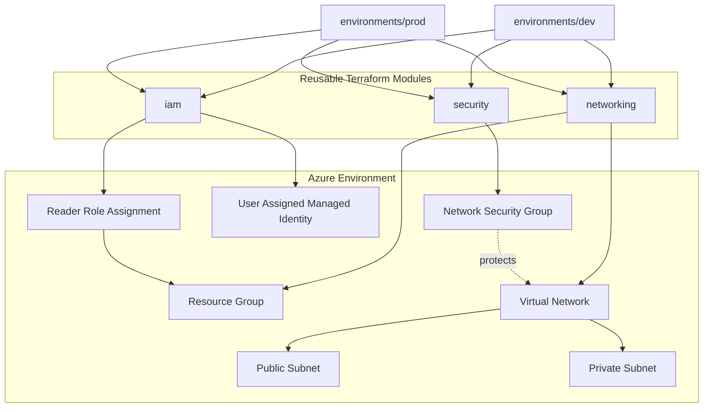

# Architecture Notes

## Scope

This repository models a reusable **Azure infrastructure foundation** using Terraform modules and environment composition.

The current scope is intentionally focused on the infrastructure primitives needed before application workloads are introduced:

- Resource groups
- Virtual networking
- Public and private subnets
- Network Security Groups
- User-assigned Managed Identity
- Azure RBAC
- Environment-specific composition

It is a portfolio baseline rather than a complete enterprise landing zone.

## High-level architecture



## Network design

Each environment creates a dedicated Azure Virtual Network with:

- One VNet address space
- One public subnet
- One private subnet
- Separate CIDR prefixes supplied through variables
- Network security controls managed independently through the security module

The current private subnet does **not** receive an implicit Internet egress path. If workloads require outbound Internet access, a controlled design such as Azure NAT Gateway, Azure Firewall or another approved egress architecture should be added explicitly.

## Module boundaries

### `modules/networking`

Owns the Azure VNet and subnet resources. It accepts environment-specific naming, location, address space and tags as inputs and exposes resource IDs as outputs.

### `modules/security`

Owns the Network Security Group and its inbound rules. Keeping security controls separate makes the network policy easier to review without changing the underlying VNet module.

### `modules/iam`

Creates a user-assigned managed identity and assigns the Azure Reader role at the environment resource-group scope.

## Environment strategy

`dev` and `prod` use the same reusable module interfaces while keeping their configuration separate.

```text
                    Reusable modules
                         /     \
                        /       \
                       ↓         ↓
              environments/dev  environments/prod
                       ↓         ↓
                    Azure Dev  Azure Prod
```

This structure prevents infrastructure implementation from being duplicated across environments.

## Identity and access model

The identity module uses a **user-assigned managed identity** rather than embedding service-principal credentials in Terraform source.

The current role assignment is scoped to the environment resource group. This provides a clear boundary for the portfolio workload identity and demonstrates resource-level RBAC rather than broad subscription-level permissions.

## Security model

The baseline follows these principles:

- No credentials stored in Terraform source
- Terraform state and local variable files excluded from Git
- Private/public network separation
- Internet-originated inbound traffic explicitly denied by the NSG rule set
- Identity permissions scoped to the environment resource group
- Infrastructure validation performed in CI before changes are considered for deployment

## State management

Local Terraform state is intentionally excluded from source control.

For a real shared production implementation, Terraform state should be stored remotely with encryption, access controls and appropriate locking/concurrency protection. That is intentionally listed as a roadmap item rather than represented as an implemented feature.

## CI / operational model

GitHub Actions currently validates both environments by running:

1. Terraform formatting checks
2. Terraform initialization without a backend
3. Terraform validation

The workflow does **not** apply infrastructure. This keeps CI validation safe and separates code validation from change execution.

A future deployment pipeline can add:

- Terraform plan artifacts
- Policy-as-code checks
- Security scanning
- Approval gates
- Federated cloud authentication
- Controlled production apply

## Design trade-offs

### Why no automatic `apply`?

Automatic infrastructure changes from a validation workflow create unnecessary operational risk. The current repository demonstrates the safer separation between validation and deployment.

### Why no NAT yet?

The private subnet is intentionally kept without Internet egress so the baseline does not imply that private workloads should have uncontrolled outbound access. Egress should be an explicit architecture decision.

### Why separate security from networking?

Network topology and security policy change for different reasons. Separate modules make those changes easier to review and reuse.

## Current limitations

This repository does not currently implement:

- AKS
- Application workloads
- Private endpoints
- NAT Gateway / Azure Firewall
- Remote Terraform state
- Policy-as-code
- Centralized diagnostics
- Automated production deployment

Those are deliberate boundaries of the current iteration, not claims of implemented functionality.
